# 20260612遠東技術交流-0609

- Source: `20260612遠東技術交流-0609.pptx`
- Total slides: 62

## Slide 1

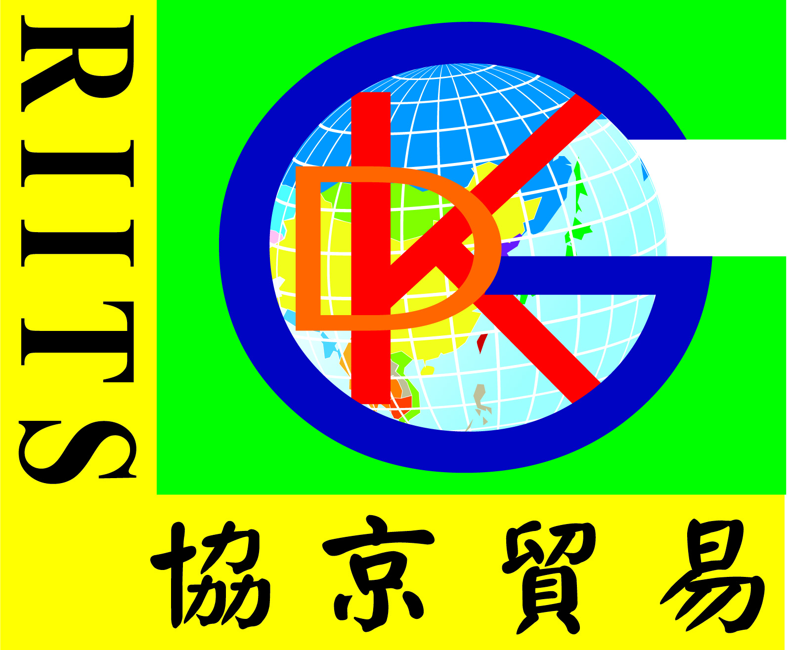

聯合技術交流會

- 蘇州遠紡
- 越南遠東
- 觀音遠東

- 協京集團
- 蘇州和京
- 越南金德
- 金皇染料
- 三義精密化工

報告日期：2026 年 6 月 12 日

Internal Technical Report

### Speaker Notes

1

## Slide 2

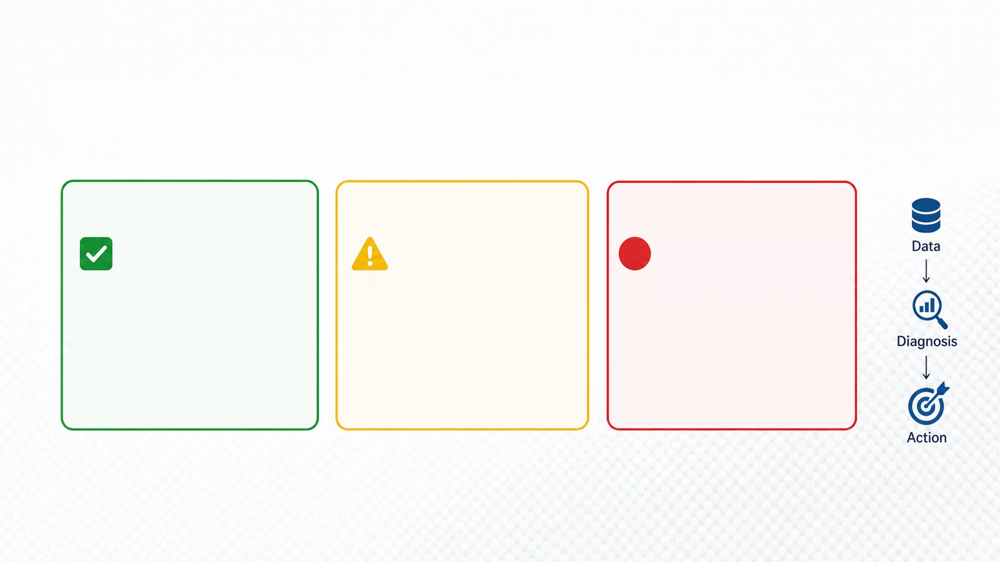

三個核心結論

⚠️ 主要風險來自現場與化驗室差異

🔴 下一階段重點：嚴重 Fail 重打與工藝標準化

✅ 染料組合方向基本正確

8 項中有 6 項偏深，需重新核對浴比、溫度、升溫斜率與持溫時間。

AJ3B-70036670 偏深 +20.31%；AA2U-70041544 偏深 +10.86%，需優先重打。

8 項 Data Color 測試，MI 全部落在 0.03–0.13，跳燈控制方向良好。

### Speaker Notes

2

## Slide 3

問題背景與改善目標

改善目標

四類核心問題

色差 / 色花 / 光源差 / 布面異常

技術挑戰

- 高 OP 布種染色穩定性不足
- 現場與化驗室條件不一致
- 染料配伍性差，易造成色花與色污
- 快速升溫導致染料急速上色
- 染缸污染可能造成布面異常色跡

改善目標

建立可複製的染料、助劑、染程與清缸標準，降低大貨 Fail 風險。

### Speaker Notes

3

## Slide 4

### Speaker Notes

4

## Slide 5

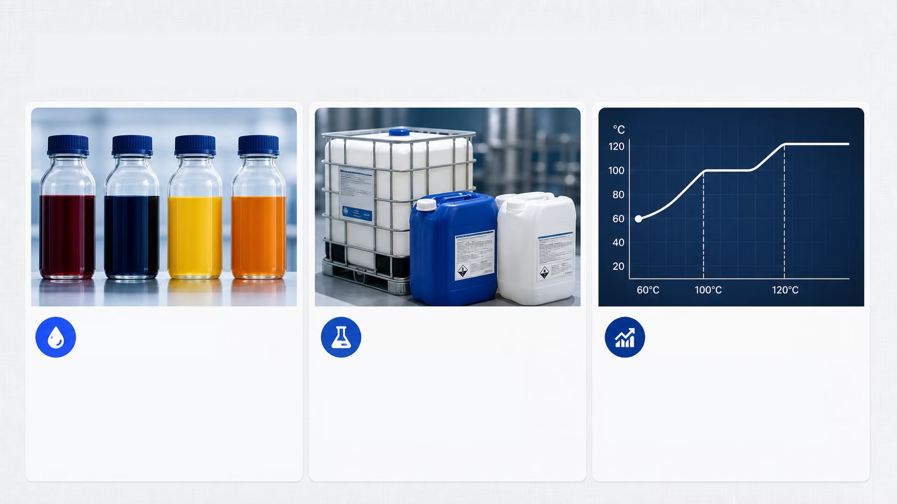

三大改善方向：染料、助劑、染程同步調整

01 染料替換

02 助劑調整

03 染程優化

- Rubine XF → 1224 Deep Red HW-SFN BS
- Navy DXF-02 → Navy Blue HWE 300% BS
- Yellow XF2 → Yellow S-GLS BS
- Orange 1515 → Yellow GLS

- TX 0.3 g/L → TX 0.9–1.0 g/L
- CELPOM 640 → CPX 2 g/L
- 新增 PAB 3 g/L

- 60→100°C 斜率 1，持溫 10 分
- 100→120°C 斜率 0.8，持溫 10 分
- pH 控制 4.5–5.5，前後差異 ≤ 0.5

### Speaker Notes

5

## Slide 6

### Speaker Notes

6

## Slide 7

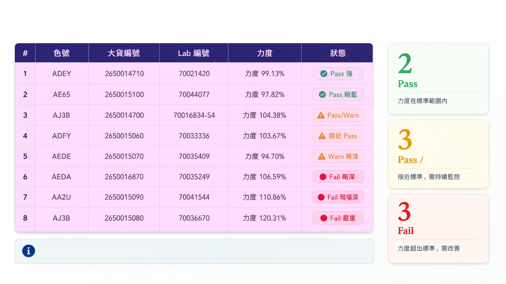

Data Color 測試總結：8 項色樣大貨 vs Lab

MI 全部良好：0.03–0.13 ｜ 6/8 項偏深 ｜ 最大異常：AJ3B-70036670 偏深 +20.31%

### Speaker Notes

7

## Slide 8

### Speaker Notes

8

## Slide 9

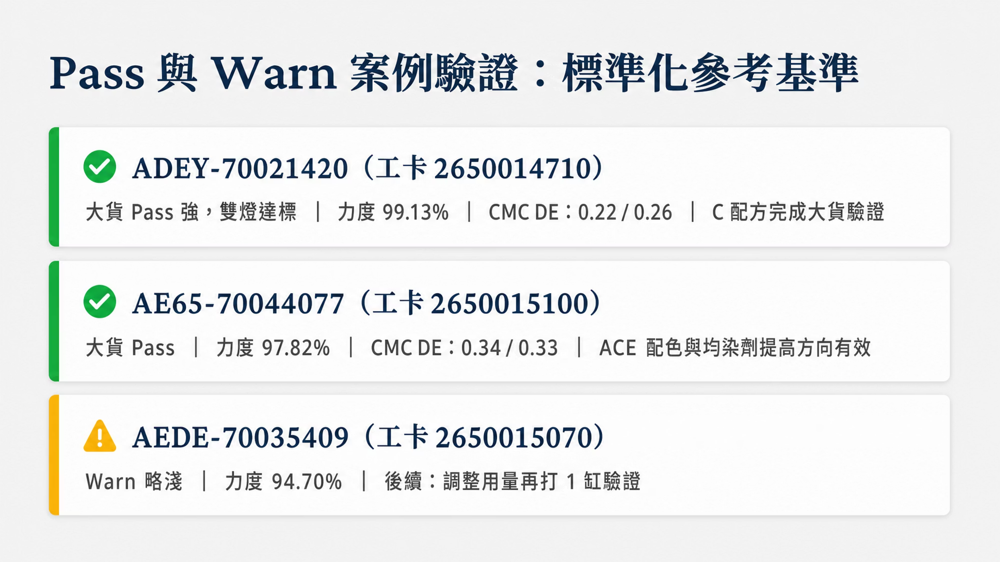

### Speaker Notes

9

## Slide 10

色样状态明细

15 项工卡进度分类 · 2026/06/05 更新

02 / 22

大货 Fail · 需调整

5

1

2

等测牢度

式染-现场染出来

2650015060 · ADFY · 70021420- 待QC ST03

2650014710 · ADEY · 70021420 PASS

2650015090 · AA2U · 70041544- 化验OK · 现场偏深 +10.86%

2650014700 · AJ3B · 70016834-S4-成品验布 SU01

2650015080 · AJ3B · 70036670- Fail 记录 +20.31% · 需重打

2650015070 · AEDE · 70035409- 成品验布 SU01

2650016870 · AEDA · 70035249- 成品验布 SU01

2650015100 · AE65 · 70044077-待委外 SV01

颜色 OK · 待排缸

继续调整中

2

1

4

染色中

2650015050 · ABZQ · 70031872

2650024840 · AJ34 · 70038437

2650014740 · ABZQ · 70025603

2650022880 · AETF · 70030349

2650022880 · AETF · 70035249

2650014570 · AJ34 · 70005795

2610047320 · AJ3B · 70038437

## Slide 11

改善方案明细

三大类改善方向 | 染料 · 助剂 · 染程

03 / 20

01

染料替换

02

助剂调整

03

染程优化

Rubine XF (旧染料)

TX 0.3 g/L (用量不足)

旧染程 (无持温)

→ 1224 Deep Red HW-SFN BS

→ TX 0.9 ~ 1.0 g/L (提高匀染)

→ 120°C 持温 10 分

Navy DXF-02 (跳灯严重)

CELPOM 640 (旧助剂)

快速升温 (色花风险)

→ Navy Blue HWE 300% BS

→ CPX 2 g/L (新助剂)

→ 60→100°C 持温 10 分 斜率 1

Yellow XF2

无 PAB

升温过快

→ Yellow S-GLS BS (新染料)

→ 新增 PAB 3 g/L

→ 100→120°C 持温 10 分 斜率 0.8

Orange 1515

常规终温

→ Yellow GLS

→ 120→130°C 斜率 0.8

Rubine XF

pH 控制

→ Dianix Rubine XFS

→ 前后 pH 差异 ≤ 0.5 / 4.5-5.5

## Slide 12

改善方案明细

三大类改善方向 | 染料 · 助剂 · 染程

03 / 20

03

染程优化

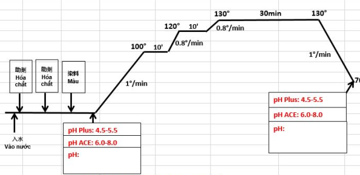

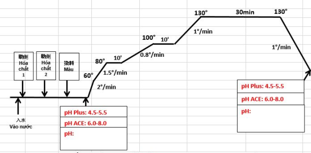

旧染程 (无持温)

→ 120°C 持温 10 分

快速升温 (色花风险)

→ 60→100°C 持温 10 分 斜率 1

升温过快

→ 100→120°C 持温 10 分 斜率 0.8

常规终温

→ 120→130°C 斜率 0.8

改后

改前

pH 控制

→ 前后 pH 差异 ≤ 0.5 / 4.5-5.5

改善方向覆盖染料/助剂/染程三大维度，适用于高 OP 染色及跳灯优化

## Slide 13

01

工卡异常跟踪

05 / 22

工卡 2650014570 · AJ34 · 布号 70005795

88% POLYESTER· 12% OP · 色差

进度跟踪

工卡基本信息

05/09

缩练定型完成

工卡号

2650014570

05/12

化验室染色

布号

70005795

05/18

复色

颜色代码

AJ34

05/21

颜色太红，继续调整

异常类别

色差

05/22

更换染料配方组合

成分

88% POLYESTER· 12% OP

05/25

收到新染料

继续调整中

Data Color 测试结果 · 大货 vs Lab

DL*

Da*

Db*

CMC DE

牢度

改善措施

—

—

—

—

—

Brill.Violet BB + Violet HWBF + Navy Blue HW-LE · TX 0.6 / 640→CPX 2g / PAB 3g / pH 4.5-5.5

待大货完成测试

改善措施：Brill.Violet BB + Violet HWBF + Navy Blue HW-LE · TX 0.6 g/L / 640→CPX 2 g/L / PAB 3 g/L / pH 4.5-5.5。主要问题为红相偏重，已更换染料组合并加入 PAB 助剂以改善穩定性。

染色异常处理报告 · Item 01 of 15 · 2026/06/05

## Slide 14

02

工卡异常跟踪

06 / 22

工卡 2650014700 · AJ3B · 布号 70016834-S4

88% POLYESTER· 12% OP · 色差

进度跟踪

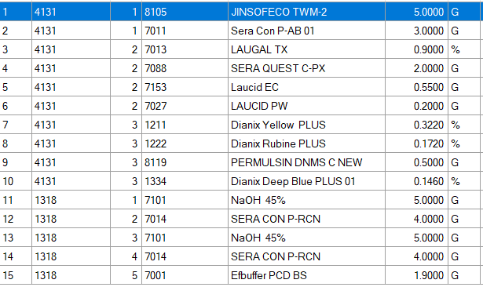

工卡基本信息

05/09

缩练定型完成

工卡号

2650014700

05/12

化验室染色

布号

70016834-S4

05/18

等确认蓝色染料

颜色代码

05/23

颜色 OK

AJ3B

异常类别

05/27

进染

色差

成分

05/31

大货完成 · Data Color

88% POLYESTER· 12% OP

06/05

成品验布 SU01

成品验布 (SU01)

Pass

Data Color 测试结果 · 大货 vs Lab

DL*

Da*

Db*

CMC DE

牢度

改善措施

-0.17 / -0.13

+0.03 / +0.05

+0.55 / +0.64

0.45 / 0.51

—

原配方染料保留 · TX 0.3→0.9 g/L · 新增 PAB 3 g/L · 染程 120°C 持温 10 min

力度 104.38% · MI 0.11 · Pass

改善措施：原配方染料保留，TX 0.3→0.9 g/L（匀染剂用量提升 3 倍），新增 PAB 3 g/L，染程调整为 120°C 持温 10 min。匀染剂的显著提升有效解决了 OP 成分导致的色差问题，此方案可作为同类布种参考基准。

染色异常处理报告 · Item 02 of 15 · 2026/06/05

## Slide 15

03

工卡异常跟踪

07 / 22

工卡 2650014710 · ADEY · 布号 70021420

56% 棉 · 40% POLYESTER· 4% OP · 色差

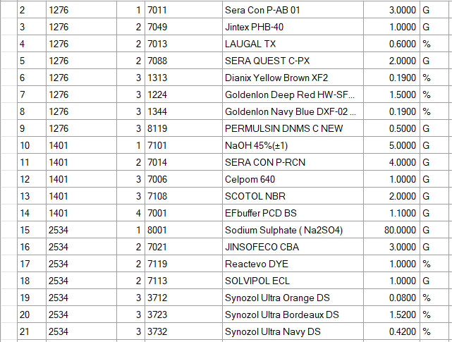

进度跟踪

工卡基本信息

05/09

缩练定型

工卡号

2650014710

05/12

化验室酵素洗 + 染色

布号

70021420

05/21

T 配方不适用

颜色代码

05/25

厂商提供 C 新配方

ADEY

异常类别

05/26

新配方颜色 OK

色差

成分

06/02

大货排缸

56% 棉 · 40% POLYESTER· 4% OP

06/05

染完 · Pass

大货 Pass 强 · 双灯达标

Pass

Data Color 测试结果 · 大货 vs Lab

DL*

Da*

Db*

CMC DE

牢度

改善措施

+0.14 / +0.11

+0.06 / -0.03

-0.21 / -0.26

0.22 / 0.26

—

C 配方 Synozol Ultra Yellow / Wine / Navy DS · 棉涤双染 · 已大货验证稳定

力度 99.13% · MI 0.11 · Pass

改善措施：采用 C 配方 — Synozol Ultra Yellow / Wine / Navy DS，棉涤双染工艺，已大货验证稳定。原 T 配方不适用于棉涤混纺布种，切换 C 配方后双灯色差均达标，建议同类棉涤混纺产品直接采用 C 配方染色。

染色异常处理报告 · Item 03 of 15 · 2026/06/05

## Slide 16

04

工卡异常跟踪

08 / 22

工卡 2650014740 · ABZQ · 布号 70025603-OP

85% POLYESTER· 15% OP · 色差

进度跟踪

工卡基本信息

05/10

缩练定型

工卡号

2650014740

05/12

化验室染色

布号

70025603-OP

05/18

等确认蓝色染料

颜色代码

ABZQ

05/21

颜色染出来太差

异常类别

色差

05/22

1310 → 1313 重新下缸

成分

85% POLYESTER· 15% OP

05/25

继续调色

继续调整中

Data Color 测试结果 · 大货 vs Lab

DL*

Da*

Db*

CMC DE

牢度

改善措施

—

—

—

—

—

Dianix Yellow Brown XF2 1.18% + Navy DXF-02 1.36% + Deep Red HW-SFN 0.052%

待大货完成测试

改善措施：Dianix Yellow Brown XF2 1.18% + Navy DXF-02 1.36% + Deep Red HW-SFN 0.052%。原配方颜色偏差明显，已切换染料组合并重新下缸，当前仍处于调色阶段，需持续跟踪化验室打样结果直至颜色达标。

染色异常处理报告 · Item 04 of 15 · 2026/06/05

## Slide 17

05

工卡异常跟踪

09 / 22

工卡 2650022880 · AETF · 布号 70030349-RP50/72

83% POLYESTER· 17% OP · 色差

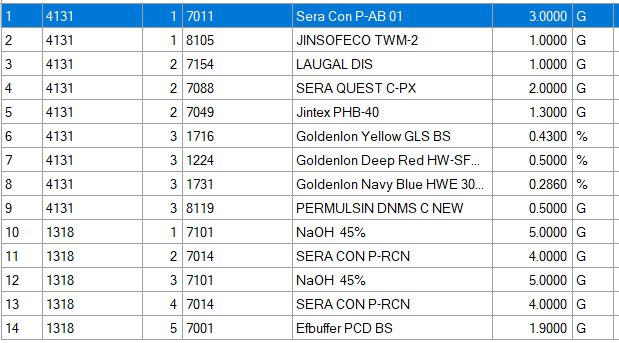

进度跟踪

工卡基本信息

05/13

化验室染色

工卡号

2650022880

05/18

等确认蓝色染料

布号

70030349-RP50/72

05/21

颜色太红

颜色代码

AETF

05/22

继续调整

异常类别

色差

05/25

调整中

成分

83% POLYESTER· 17% OP

06/05

工卡 2650022880 大货染色

染色中

Data Color 测试结果 · 大货 vs Lab

DL*

Da*

Db*

CMC DE

牢度

改善措施

—

—

—

—

—

Orange 1515→Yellow GLS · Rubine→1224 Deep Red · Navy DXF→Navy HWE 300% · TX→DIS 1 g/L

待大货完成测试

改善措施：Orange 1515→Yellow GLS · Rubine→1224 Deep Red · Navy DXF→Navy HWE 300% · TX→DIS 1 g/L。本工卡色相偏红问题通过更换橙、红、蓝三路染料逐步调整，进行大货染色，出缸后需立即进行 Data Color 检测验证。

染色异常处理报告 · Item 05 of 15 · 2026/06/05

## Slide 18

06

工卡异常跟踪

10 / 22

工卡 2650015050 · ABZQ · 布号 70031872

85% POLYESTER· 15% OP · 色差

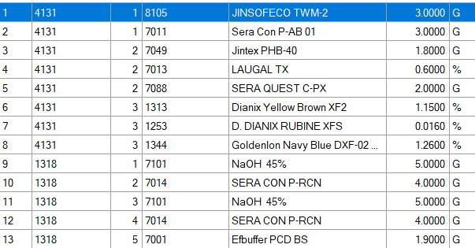

进度跟踪

工卡基本信息

05/12

缩练定型

工卡号

2650015050

05/13

化验室染色

布号

70031872

颜色代码

05/18

等确认蓝色染料

ABZQ

异常类别

色差

05/22

1310→1313 重新下缸

成分

85% POLYESTER· 15% 弹性纤维

06/05

工卡 2650015050 大货染色

染色中

Data Color 测试结果 · 大货 vs Lab

DL*

Da*

Db*

CMC DE

牢度

改善措施

—

—

—

—

—

Dianix Yellow Brown XF2 1.28% + Dianix Rubine XFS 0.16% + Goldenlon Blue DXF-02 BS 1.26%

待大货完成测试

改善措施：Dianix Yellow Brown XF2 1.28% + Dianix Rubine XFS 0.16% + Goldenlon Blue DXF-02 BS 1.26%。本工卡与工卡 2650014740 同为 ABZQ 色号，已共享染料配方调整方案。今日大货下缸，出缸后需进行 Data Color 大货 vs Lab 对比测试，确认 DL* 偏差在允许范围内。

染色异常处理报告 · Item 06 of 15 · 2026/06/05

## Slide 19

07

工卡异常跟踪

11 / 22

工卡 2650015060 · ADFY · 布号 70033336

100% POLYESTER · 色差

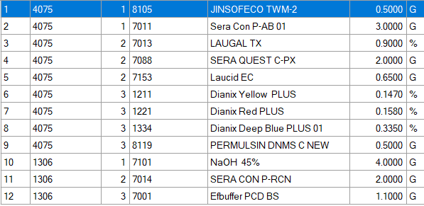

进度跟踪

工卡基本信息

05/09

缩练定型

工卡号

2650015060

05/11

订边完成

布号

70033336

05/18

打色中

颜色代码

05/22

颜色 OK

ADFY

异常类别

05/27

进染

色差

成分

05/31

大货完成 · Data Color

100% 再生聚酯

06/05

待QC测试 ST03

待QC测试 (ST03)

OK

Data Color 测试结果 · 大货 vs Lab

DL*

Da*

Db*

CMC DE

牢度

改善措施

-0.57 / -0.56

-0.02 / -0.02

+0.39 / +0.43

0.50 / 0.51

—

Dianix Yellow PLUS 0.179% + Red PLUS 0.19% + Deep Blue PLUS 01 0.39% · TX 0.9 g/L · CPX 2 g/L · PAB 3 g/L

力度 103.67% · MI 0.03 · 接近 Pass (Warn)

改善措施：Dianix Yellow PLUS 0.179% + Red PLUS 0.19% + Deep Blue PLUS 01 0.39% · TX 0.9 g/L · CPX 2 g/L · PAB 3 g/L。采用 PLUS 系列染料配方，适用于再生聚酯布种，助剂体系已按新标准执行（TX 提升 + CPX + PAB 三剂并用），等待 QC 部门进行牢度测试（ST03）。

染色异常处理报告 · Item 07 of 15 · 2026/06/05

## Slide 20

08

工卡异常跟踪

12 / 22

工卡 2650016870 · AEDA · 布号 70035249

80% POLYESTER· 20% OP · 色花

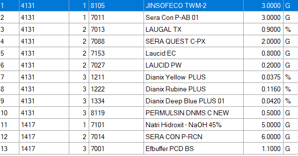

进度跟踪

工卡基本信息

05/12

胚布预缩

工卡号

2650016870

05/13

化验室染色

布号

70035249

05/21

颜色 OK

颜色代码

AEDA

05/25

进行染色

异常类别

色花

05/31

大货完成 · Data Color Fail

成分

80% POLYESTER· 20% OP

06/05

成品验布 SU01

成品验布 (SU01) · 大货 Fail 偏深

Fail

Data Color 测试结果 · 大货 vs Lab

DL*

Da*

Db*

CMC DE

牢度

改善措施

-0.80 / -0.78

+0.66 / +0.63

-0.49 / -0.50

0.76 / 0.76

—

原配方染料 · TX 1.0 g/L (匀染剂提高) · ABLUTEX BLM-F 0.2 g/L · 升温速率降慢

力度 106.59% · MI 0.04 · Fail · 偏深 +6.59%

改善措施：原配方染料保留 · TX 1.0 g/L（匀染剂提高）· ABLUTEX BLM-F 0.2 g/L · 升温速率降慢。大货偏深表明化验室与现场存在系统性工艺差异（浴比、升温速率或持温时间不一致），需重新核对现场参数后调整用量重打。

染色异常处理报告 · Item 08 of 15 · 2026/06/05

## Slide 21

09

工卡异常跟踪

13 / 22

工卡 2650022880 · AETF · 布号 70035249

80% POLYESTER· 20% OP · 色差

进度跟踪

工卡基本信息

05/12

缩练定型

工卡号

2650022880

05/13

化验室染色

布号

70035249

05/18

等确认蓝色染料

颜色代码

AETF

05/21

颜色太红

异常类别

色差

05/22

继续调整

成分

80% POLYESTER· 20% OP

05/25

调整中

继续调整中

Data Color 测试结果 · 大货 vs Lab

DL*

Da*

Db*

CMC DE

牢度

改善措施

—

—

—

—

—

苏州 1312 Y XF2→Y GLS BS · Rubine XF→Deep Red HWSFN BS · Navy→Blue HWE 300% · TX 0.9 g/L

待大货完成测试

改善措施：苏州 1312 Y XF2→Y GLS BS · Rubine XF→Deep Red HWSFN BS · Navy→Blue HWE 300% · TX 0.9 g/L。本工卡同色号 AETF 在不同布号上均出现偏红问题，已系统更换三路染料并提升匀染剂用量，调整方向与工卡 2650022880/70030349 一致。

染色异常处理报告 · Item 09 of 15 · 2026/06/05

## Slide 22

10

工卡异常跟踪

14 / 22

工卡 2650015070 · AEDE · 布号 70035409-RP100/96-S1

80% POLYESTER· 20% OP · 色花

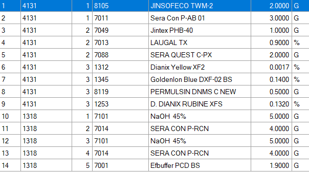

进度跟踪

工卡基本信息

05/09

缩练定型

工卡号

2650015070

05/11

背面订边

布号

70035409-RP100/96-S1

05/18

打色

颜色代码

05/22

颜色偏蓝继续调整

AEDE

异常类别

05/25

颜色 OK

色花

成分

05/31

大货完成 · Data Color Warn

80% POLYESTER· 20% 弹性纤维

06/05

成品验布 SU01

成品验布 (SU01) · 大货 Warn 偏淡

OK

Data Color 测试结果 · 大货 vs Lab

DL*

Da*

Db*

CMC DE

牢度

改善措施

+0.79 / +0.77

-0.41 / -0.33

-0.22 / -0.26

0.55 / 0.50

—

RUBINE XF→DIANIX RUBINE XFS · TX 1.0 g/L · ABLUTEX BLM-F 0.2 g/L · 升温速率降慢

力度 94.70% · MI 0.10 · Warn · 偏淡 -5.30%

改善措施：RUBINE XF→DIANIX RUBINE XFS · TX 1.0 g/L · ABLUTEX BLM-F 0.2 g/L · 升温速率降慢。颜色偏淡提示现场与化验室存在上染率差异，需调整大货用量比例并验证 1 缸，确保 DL* 差异在警戒线以内。

染色异常处理报告 · Item 10 of 15 · 2026/06/05

## Slide 23

11

工卡异常跟踪

15 / 22

工卡 2650015080 · AJ3B · 布号 70036670

77% POLYESTER· 23% OP · 色差

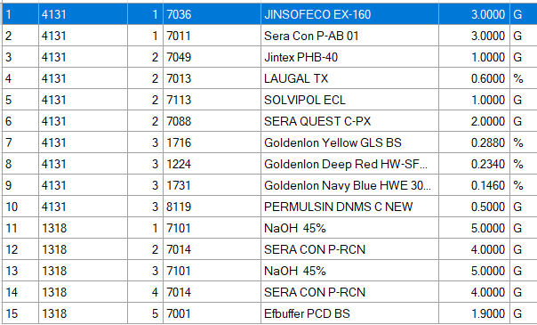

进度跟踪

工卡基本信息

05/09

缩练定型

工卡号

2650015080

05/12

化验室染色

布号

70036670

颜色代码

05/22

颜色 OK

AJ3B

异常类别

色差

06/02

工卡 2650015080 大货排缸

成分

77% POLYESTER· 23% OP

06/05

大货 Fail 记录

大货 Fail 记录 +20.31%

Fail

Data Color 测试结果 · 大货 vs Lab

DL*

Da*

Db*

CMC DE

牢度

改善措施

-3.27 / -3.31

+0.33 / +0.23

-0.77 / -0.87

1.73 / 1.77

—

Rubine→1224 Deep Red 厂内 · Navy BDXF→Navy HWE 300% · TX 0.6 g/L · CPX 2 g/L · 120°C 持温 10 min ⚠️ 减用量 17~18% 重打

力度 120.31% · MI 0.09 · Fail 严重 · 重打

改善措施：Rubine→1224 Deep Red 厂内 · Navy BDXF→Navy HWE 300% · TX 0.6 g/L · CPX 2 g/L · 120°C 持温 10 min。⚠️ 偏差 +20.31% 属严重超标，需减用量 17～18% 重打。此为本次报告中偏差最大的一项，优先级最高，需立即安排重打计划。

染色异常处理报告 · Item 11 of 15 · 2026/06/05

## Slide 24

12

工卡异常跟踪

16 / 22

工卡 2650024840 · AJ34 · 布号 70038437

93% POLYESTER· 7% OP · 色差

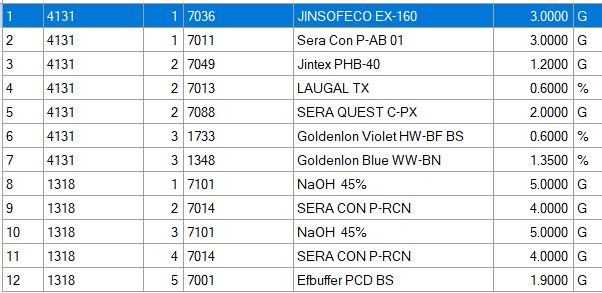

进度跟踪

工卡基本信息

05/18

打色中

工卡号

2650024840

05/21

颜色太红

布号

70038437

颜色代码

05/22

更换染料配方

AJ34

异常类别

色差

05/25

收到新染料

成分

93% POLYESTER· 7% OP

06/05

颜色 OK · 工卡 2650024840 待排缸

颜色OK · 待排缸

Data Color 测试结果 · 大货 vs Lab

DL*

Da*

Db*

CMC DE

牢度

改善措施

—

—

—

—

—

1224 Deep Red + 1357 Royal Blue + 1567 Neocron Violet R H/C BS

待大货完成测试

改善措施：1224 Deep Red + 1357 Royal Blue + 1567 Neocron Violet R H/C BS。颜色偏红问题通过更换三路染料组合已解决，化验室确认颜色 OK，当前等待安排大货排缸。建议优先排入生产计划，避免等待时间过长影响交期。

染色异常处理报告 · Item 12 of 15 · 2026/06/05

## Slide 25

13

工卡异常跟踪

17 / 22

工卡 2610047320 · AJ3B · 布号 70038437

93% POLYESTER· 7% OP · 色差

进度跟踪

工卡基本信息

D0

初始

工卡号

2610047320

布号

05/18

等确认蓝色染料

70038437

颜色代码

AJ3B

05/21

颜色染出来红黄

异常类别

色差

成分

05/22

继续调整

93% POLYESTER· 7% OP

继续调整中

Data Color 测试结果 · 大货 vs Lab

DL*

Da*

Db*

CMC DE

牢度

改善措施

—

—

—

—

—

Dianix Rubine XFS · TX 1.0 g/L · ABLUTEX BLM-F 0.2 g/L · 升温速率降慢

待大货完成测试

改善措施：Dianix Rubine XFS · TX 1.0 g/L · ABLUTEX BLM-F 0.2 g/L · 升温速率降慢。注意：本工卡布号 70038437 与工卡 2650024840（AJ34）相同，但颜色代码为 AJ3B，属于同一布匹不同颜色的异常工卡，需注意区分调整方向，避免方案混用。

染色异常处理报告 · Item 13 of 15 · 2026/06/05

## Slide 26

14

工卡异常跟踪

18 / 22

工卡 2650015090 · AA2U/ABZU/095A · 布号 70041544

85% POLYESTER· 15% OP · 色差

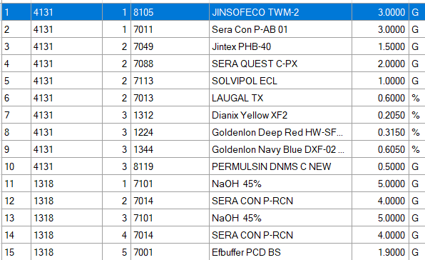

进度跟踪

工卡基本信息 ·

05/11

DF05 重新溜布

工卡号

2650015090

05/12

化验室染色

布号

70041544

05/21

TL84 灯色变

颜色代码

AA2U/ABZU/095A

05/22

用原配方下缸

异常类别

色差

05/26

化验室颜色 OK

成分

85% POLYESTER· 15%OP

05/31

大货 Data Color Fail 严重

大货 Fail · 化验室OK · 现场偏深

Fail

Data Color 测试结果 · 大货 vs Lab

DL*

Da*

Db*

CMC DE

牢度

改善措施

-1.54 / -1.53

+0.10 / +0.20

-0.72 / -0.74

1.29 / 1.32

—

Yellow XF2→1310 · Navy DXF→Navy HWE 300% · TX 0.6 g/L · CPX 2 g/L ⚠️ 化验室OK 现场偏深 +10.86% · 需改善工艺 (浴比/温度/持温)

力度 110.86% · MI 0.09 · Fail · 现场偏深

改善措施：Yellow XF2→1310 · Navy DXF→Navy HWE 300% · TX 0.6 g/L · CPX 2 g/L。⚠️ 化验室 OK 但现场偏深 +10.86%，属系统性差异，根本原因为浴比/温度/持温时间不一致。建议减全部用量 9～10%，同时核对现场浴比与升温斜率参数。

染色异常处理报告 · Item 14 of 15 · 2026/06/05

## Slide 27

15

工卡异常跟踪

19 / 22

工卡 2650015100 · AE65/AJ34/6105C/2717C · 布号 70044077

85% POLYESTER· 15% OP · 色花

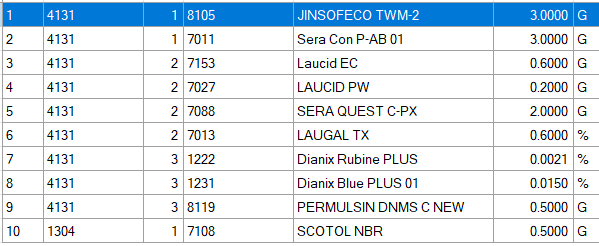

进度跟踪

工卡基本信息

05/11

缩练定型

工卡号

2650015100

05/12

化验室染色

布号

70044077

05/21

颜色 OK

颜色代码

AE65/AJ34/6105C/2717C

05/25

进行染色

异常类别

色花

05/27

大货完成 · Data Color Pass

成分

85% POLYESTER· 15% OP

06/05

待委外加工 SV01

待委外加工 (SV01) · 大货 Pass

Pass

Data Color 测试结果 · 大货 vs Lab

DL*

Da*

Db*

CMC DE

牢度

改善措施

+0.24 / +0.23

+0.08 / +0.05

-0.32 / -0.36

0.34 / 0.33

—

ACE 配色 · 均染剂加高 · TX 1.0 g/L · Dianix Orange PLUS + Rubine PLUS + Blue PLUS 01

力度 97.82% · MI 0.05 · Pass ·

改善措施：ACE 配色方案 · 匀染剂加高 · TX 1.0 g/L · Dianix Orange PLUS + Rubine PLUS + Blue PLUS 01。本工卡色花问题通过提高匀染剂用量及使用 PLUS 系列染料成功解决，大货 Data Color 测试 Pass，当前等待安排委外加工（SV01）。

染色异常处理报告 · Item 15 of 15 · 2026/06/05

## Slide 28

Data Color 大货 vs Lab 测试总结

8 项色样测试结果

2026/06/05

以下数据为 8 项色样大货与化验室样品之间的 Data Color 色差对比结果，涵盖 D65 及 F11 双光源下的 DL*、Da*、Db* 及 CMC DE 数值，用于评估现场与化验室的系统性偏差。

颜色代码

工卡号

布号

DL* D65/F11

Da* D65/F11

Db* D65/F11

CMC DE

状态

ADEY

2650014710

70021420

+0.14 / +0.11

+0.06 / -0.03

-0.21 / -0.26

0.22 / 0.26

Pass 强 · 力度 99.13%

AE65

2650015100

70044077

+0.24 / +0.23

+0.08 / +0.05

-0.32 / -0.36

0.34 / 0.33

Pass 强 · 力度 97.82%

AJ3B

2650014700

70016834-S4

-0.17 / -0.13

+0.03 / +0.05

+0.55 / +0.64

0.45 / 0.51

Pass 略蓝

测试结论：已测 3 项均在可接受范围内（CMC DE ≤ 0.51）。其中 ADEY 和 AE65 表现优异，AJ3B 略有蓝相偏差但仍在 Pass 范围。其余 5 项色样正在跟进中，出缸后将第一时间补充测试数据。

### Speaker Notes

28

## Slide 29

DATA COLOR · 大货 vs Lab 测试结果

8 项色样 Data Color 测试总结

20 / 22

颜色

工卡

布号

DL* D65/F11

Da* D65/F11

Db* D65/F11

CMC DE

牢度

测试结果

ADEY

2650014710

70021420

+0.14/+0.11

+0.06/-0.03

-0.21/-0.26

0.22/0.26

—

力度 99.13%

Pass 强

AE65

2650015100

70044077

+0.24/+0.23

+0.08/+0.05

-0.32/-0.36

0.34/0.33

—

力度 97.82%

Pass略蓝

AJ3B

2650014700

70016834-S4

-0.17/-0.13

+0.03/+0.05

+0.55/+0.64

0.45/0.51

—

力度 104.38%

Pass·Warn

ADFY

2650015060

70033336

-0.57/-0.56

-0.02/-0.02

+0.39/+0.43

0.50/0.51

—

力度 103.67%

接近 Pass

AEDE

2650015070

70035409

+0.79/+0.77

-0.41/-0.33

-0.22/-0.26

0.55/0.50

—

力度 94.70%

Warn 略浅

AEDA

2650016870

70035249

-0.80/-0.78

+0.66/+0.63

-0.49/-0.50

0.76/0.76

—

力度 106.59%

Fail 略深

AA2U

2650015090

70041544

-1.54/-1.53

+0.10/+0.20

-0.72/-0.74

1.29/1.32

—

力度 110.86%

Fail 现场深

AJ3B

2650015080

70036670

-3.27/-3.31

+0.33/+0.23

-0.77/-0.87

1.73/1.77

—

力度 120.31%

Fail 记录

🔍 关键发现

MI 全部良好 (0.03 ~ 0.13)

8 个组合的跳灯表现都很好 → 染料组合方向正确

01

6/8 项偏深 (+3.5% ~ +20.3%)

现场染色普遍比化验室深, 需重新检查浴比/温度/持温时间

02

AJ3B-70036670 +20.31% 创记录

Fail 严重, 需减用量 17~18% 重打 + 工艺改善

03

## Slide 30

### Speaker Notes

30

## Slide 31

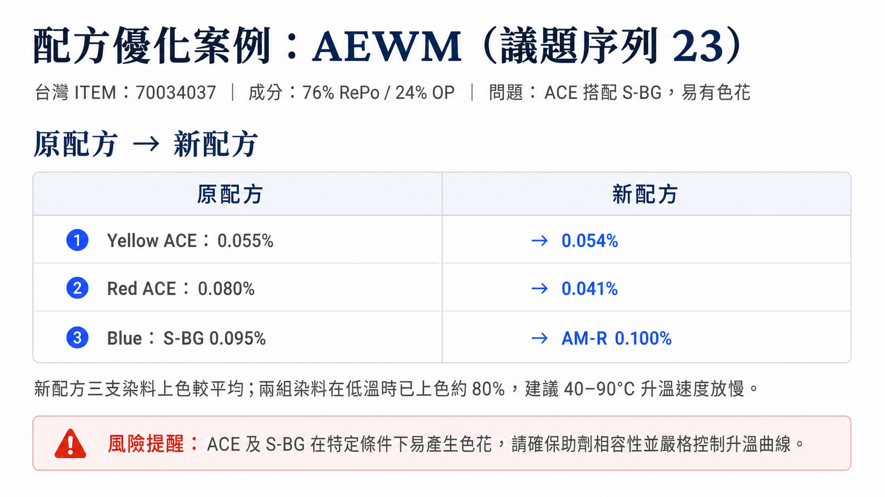

### Speaker Notes

31

## Slide 32

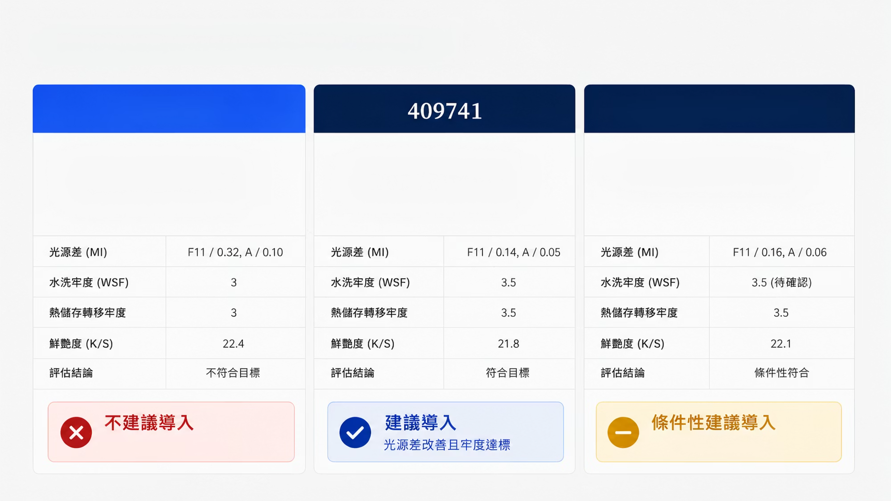

牢度與光源差改善案例

PU90925

RS9D0042-PE02AT

新配方鮮艷度可接受，但光源差大，水洗牢度與熱儲存轉移牢度未達 3.5 級以上。不能只看色光，需同步確認牢度。

Riits 與 DyStar 皆提供光源差較小配方。DyStar MI：F11 / 0.14，A / 0.05。光源差改善需 MI 數據驗證。

目標改善 WSF 至 3.5 以上。Riits 與 DyStar 配方光源差都小。待遠東確認水洗牢度是否可接受。

新配方鮮艷度可接受，但光源差大，水洗牢度與熱儲存轉移牢度未達 3.5 級以上。不能只看色光，需同步確認牢度。

目標改善 WSF 至 3.5 以上。Riits 與 DyStar 配方光源差都小。待遠東確認水洗牢度是否可接受。

### Speaker Notes

32

## Slide 33

### Speaker Notes

33

## Slide 34

遠東集團 議題改善方案彙整報告

本報告彙整 2026 年 3 月至 5 月間，遠東集團製程與染整研發團隊針對各布種所提出之染整議題改善方案，涵蓋配方優化、牢度提升、色花改善、布面異常排除等多項技術議題，共計 11 個議題序列（#023、#034～#043），由台灣化驗室及台灣染色現場團隊協同研發提出。

議題總數

11 個議題序列，涵蓋配方、牢度、布面品質

建檔期間

2026/03/17 ～ 2026/05/08

申請單位

台灣化驗室 · 台灣染色現場

主要品牌

ALO YOGA · PATAGONIA · 一般內部品項

### Speaker Notes

34

## Slide 35

議題總覽

11 項議題分類索引

以下為本次彙整之所有議題序列，依問題類型分類，便於快速查閱相關改善方案。

序列

項目名稱

台灣 ITEM

問題描述

申請人

建檔日期

023

2026/03/17

優化配方組合

70034037

ACE搭配S-BG易有色花

黃君儀

034

PU90925

WSF/MIGS 牢度不足

陳建志

2026/04/16

改善牢度鮮豔度 D65/TL84

035

2026/04/20

ALO YOGA 改善酚黃

ARF3782

酚黃 3.5 需提升至 4.0

黃君儀

036

1113

尼龍布種橫條嚴重

台灣化驗室

2026/04/28

PATAGONIA 改善橫條

037

2026/04/29

改善光源差

409741

TL84 光源差

台灣化驗室

038

6298

布面色跡

台灣染色

2026/05/01

改善布面異常（色跡）

039

2026/05/01

改善布面異常（色跡）

4495

布面色跡

台灣染色

040

改善牢度 D65/CWF

RS9D0042

台灣化驗室

2026/05/08

WSF 2.5N 須提升至 3.5+

041

2026/05/08

替代配方組合

647843

光源差不符合，限用染料

台灣化驗室

042

4397

布面雞爪

台灣染色現場

2026/05/08

改善布面品質（雞爪）

043

2060

布面雞爪

台灣染色現場

2026/05/08

改善布面異常（雞爪）

### Speaker Notes

35

## Slide 36

議題序列 #023

優化配方組合——改善色花問題

基本資訊

配方比較

申請人

黃君儀

染料成分

原配方

新配方

建檔時間

2026/03/17

Dianix Yellow ACE

0.055%

0.054%

台灣 ITEM

70034037

Dianix Red ACE

0.080%

0.041%

布別

40RP30SP30 R WA

顏色

AEWM

Goldenlon T/Blue S-BG

0.095%

—

成分

76% RePo · 24% OP

Dianix Blue AM-R

—

0.100%

問題描述

原配方採用 ACE 系列搭配 S-BG 藍色染料，在實際染色過程中，由於藍色染料（Goldenlon T/Blue S-BG）上色速率不均，在 90℃ 時發生快速上色現象，造成明顯色花。三支染料間的上色平衡性不足，是導致色花的核心問題。

結論與建議

新配方以 Dianix Blue AM-R 取代 Goldenlon T/Blue S-BG，三支染料上色速率更為均勻。階段染色測試顯示，新配方整體色光及光源差尚可接受。

由階段染色可觀察出，兩組配方在低溫時即已上色約 80%。建議在 30℃～90℃ 升溫段放慢升溫速度，以進一步抑制色花發生。

已於 5/25 補上階段染色數據，提供遠東確認配方可行性。

### Speaker Notes

36

## Slide 37

議題序列 #023 — 階段染色分析

階段染色上色行為解析

以下附件呈現原配方與新配方在各溫度階段的上色行為差異，是判斷色花成因與配方改善效果的關鍵依據。

附件一：配方色光比對

附件一（續）：色樣對照

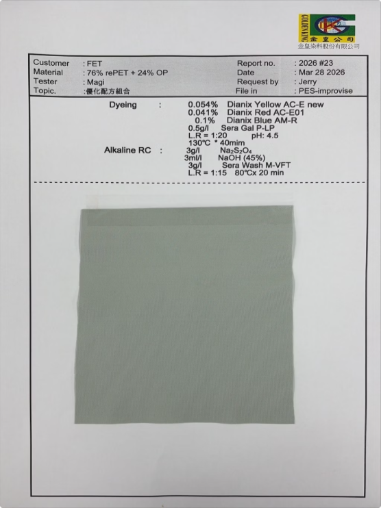

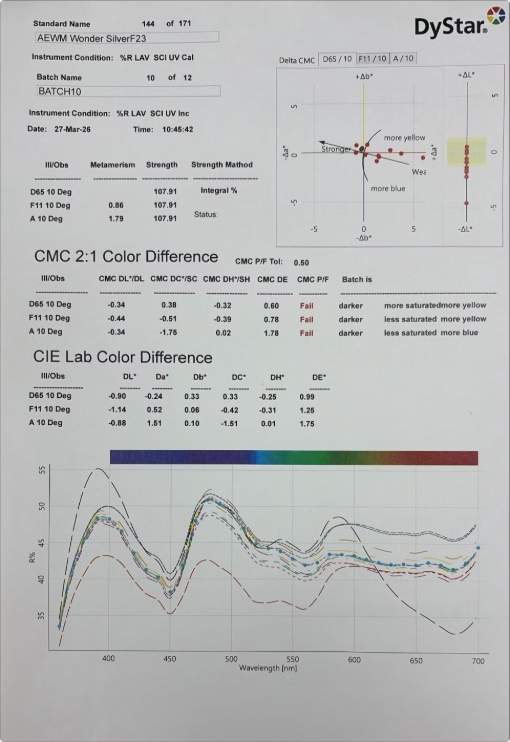

附件二：階段染色曲線（原配方）

附件二：階段染色曲線（新配方）

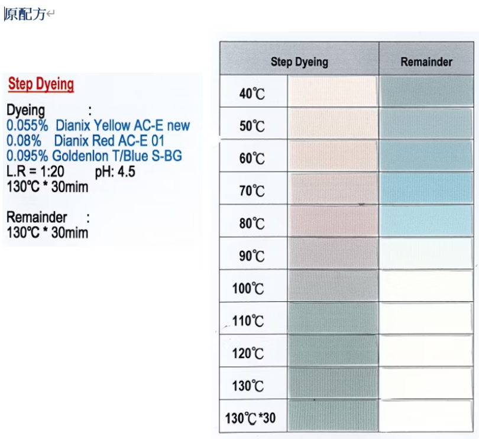

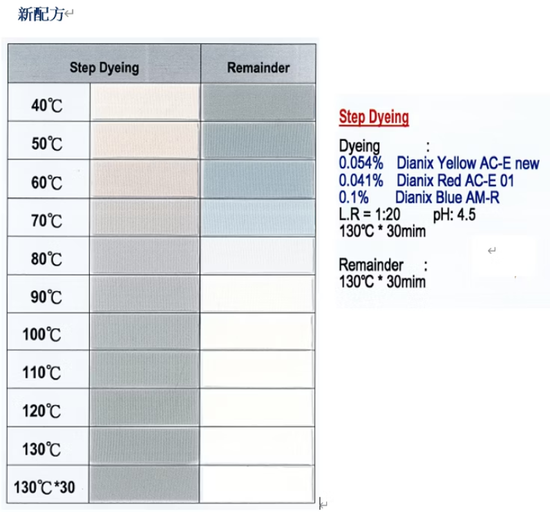

原配方藍色染料在 90℃ 發生急速上色，三支染料上色不均為色花主因。新配方三支染料上色速率趨於平均，有效改善色花風險。

### Speaker Notes

37

## Slide 38

議題序列 #034

改善牢度與鮮豔度——光源 D65/TL84

基本資訊

實驗結果

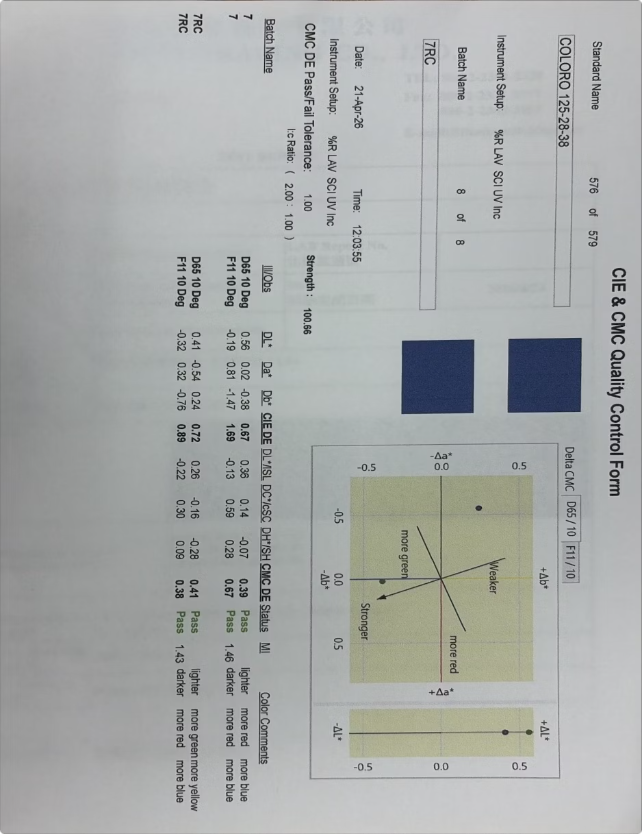

申請人

陳建志

建檔時間

2026/04/16

台灣 ITEM

PU90925

布別

32RP50SP140 R TRICOT MESH

顏色

125-28-38

成分

80% Recycled Polyester · 14% Spandex

問題描述

原配方之水洗牢度（WSF）僅達 2.5N／3 ACE 3.0 ST，目標需提升至 3.5 以上；同時摩擦牢度（MIGS）僅 2 ST，需提升至 4.0。此外，色彩鮮豔度及 D65/TL84 雙光源差亦為改善目標。

配方比較

項目

原配方

新配方

Br. Violet B

0.475%

—

Br. Blue RN BS

1.000%

0.440%

Br. Violet RR BS

—

0.500%

Br. Violet BB BS

—

1.800%

結論：原配方已是目前最佳組合。新配方鮮豔度尚可，但光源差偏大，且水洗牢度未達 3.5 級以上目標要求，建議持續研究更適合的染料組合。

### Speaker Notes

38

## Slide 39

議題序列 #035

ALO YOGA 品牌——改善酚黃問題

基本資訊

建議配方對比

申請人

黃君儀

建議配方 #6

建議配方 #7

項目

原配方

建檔時間

2026/04/20

D Red AE-C 01

0.0002%

—

—

台灣 ITEM

ARF3782

28RP75RP50SP40 E WA 上漿切邊

布別

D Blue AE-C

0.0002%

—

—

顏色

WHITE（白色）

E. Violet 2RE

0.0030%

—

—

成分

89% RePo · 11% OP

測試方法

ISO 105-X18:2007

Sera White P-B

0.700%

0.300%

0.300%

問題描述

Sera White P-R

0.300%

0.380%

0.350%

白色布品在後加工過程中發生酚黃（Phenolic Yellowing）現象，原酚黃牢度僅 3.5，需改善至 4.0 以上，以符合 ALO YOGA 品牌嚴格的品質標準。

Sera Sperse M-HZ

—

0.50 g/l

—

PH 4.5，130℃×30min，直接烘乾

後處理

—

1.0 g/l 檸檬酸，浸泡 10 min

解決方案

遠東回覆：在後定型前調整 pH 值，已成功解決酚黃問題，無需更改染料配方。此方案已於 5/4 確認並實施。

根據實驗結果，配方 #6 採用染後浸泡 1.0 g/l 檸檬酸約 10 分鐘的後處理工序，可有效降低酚黃風險；配方 #7 則直接在 PH 4.5 條件下進行 130℃×30min 染色後烘乾，操作更為簡便。

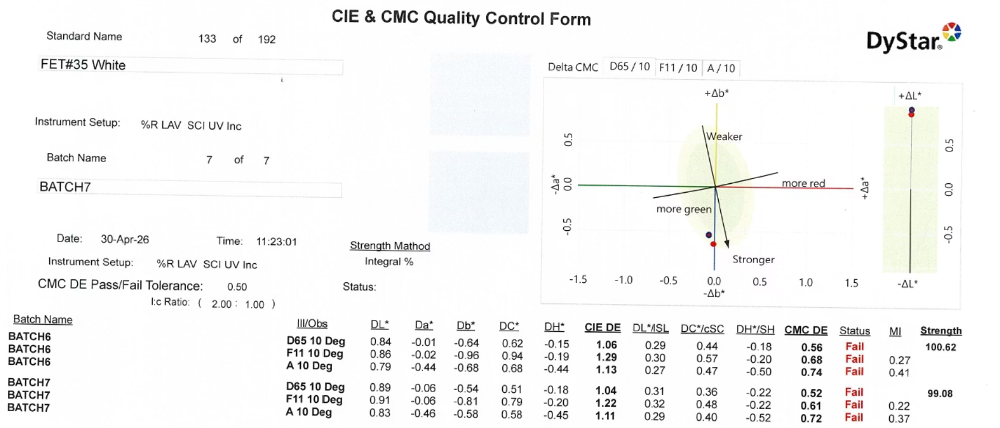

### Speaker Notes

39

## Slide 40

議題序列 #036

PATAGONIA——改善尼龍布種橫條問題

基本資訊

前處理工序說明

申請人

台灣化驗室

前處理劑配方

建檔時間

2026/04/28

2.0% Revecol LV-AN（橫條處理劑），調酸 PH 4.5

台灣 ITEM

1113

布別

42RE-N30BKLYCRA30 R WA

前處理溫度

100℃ 持溫 30 分鐘，後取出清洗

成分

78% ReNy · 22% LY

顏色

PG 黑 · 菌菇棕 · 靜湖藍 · 植物綠

熱水沖洗

95℃ 熱水沖洗 10 分鐘，確保助劑均勻滲透

問題描述

PATAGONIA 指定布種為再生尼龍（ReNy）混萊卡（LY）結構，因尼龍纖維特性，胚布於染色過程中橫條現象嚴重，影響成品布面均勻性與外觀品質。

結論：方案（2）胚布前處理後染色橫條現象改善效果最佳，其次為方案（4）。建議以前處理作為標準作業流程。已提供色布供遠東確認品質標準。

實驗設計

本次實驗採用 2×2 分組設計，對比胚布前處理與染色添加劑 LV-CT 之交互效果，共四組：

- （1）原胚布直接染色
- （2）胚布前處理後染色
- （3）原胚布染色 + 2.0% LV-CT
- （4）胚布前處理後染色 + 2.0% LV-CT

### Speaker Notes

40

## Slide 41

議題序列 #036 — 附件

PATAGONIA 橫條改善——布面效果比較

以下四組色布附件呈現不同處理條件下的布面橫條改善效果，供遠東評估各處理方案的實際成效。

（1）原胚布染色 vs（2）前處理後染色

（3）原胚布 + LV-CT vs（4）前處理 + LV-CT

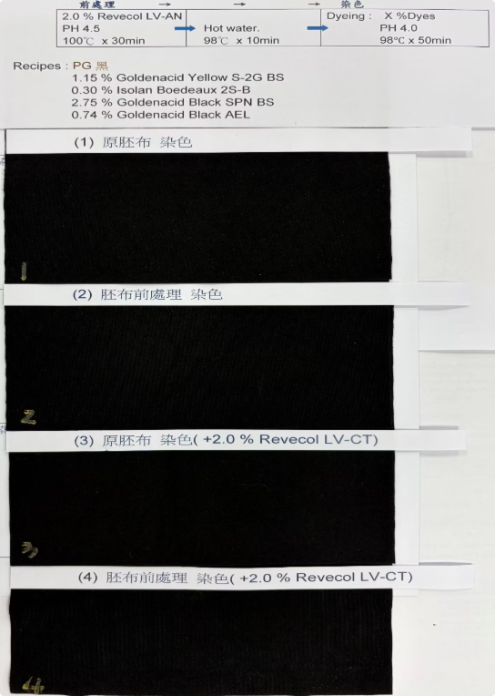

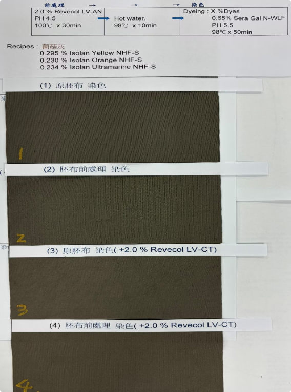

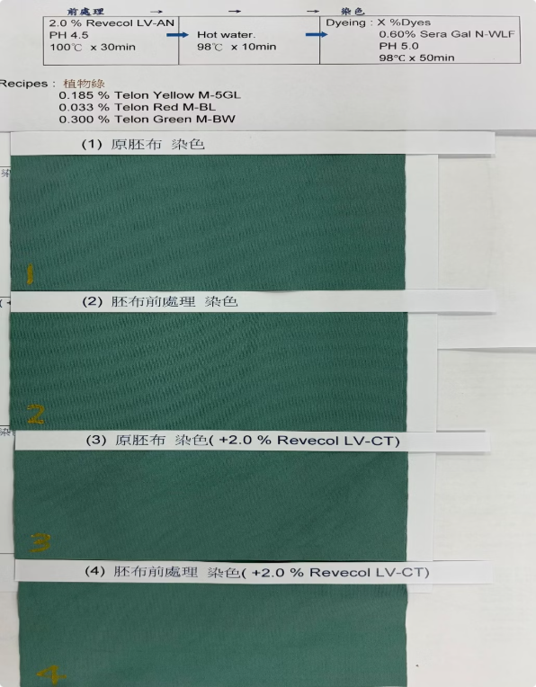

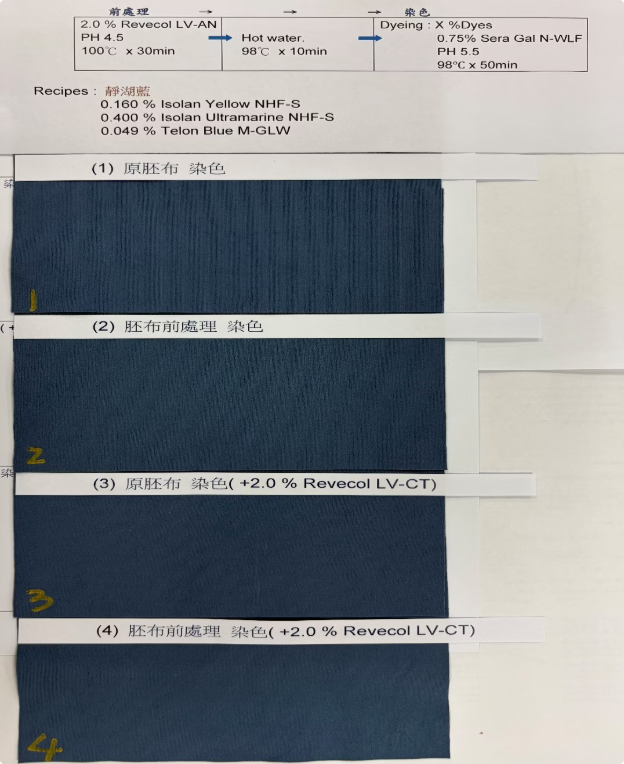

### Speaker Notes

41

## Slide 42

議題序列 #037

改善光源差——TL84 配方優化

基本資訊

光源差比較（MI 值）

申請人

台灣化驗室

原配方

Riits 配方

建檔時間

2026/04/29

- F11 / 0.22
- A / 0.38

- F11 / 0.19
- A / 0.28

台灣 ITEM

409741

布別

28FD75SDF30 E WA

DyStar 配方

顏色

01P

- F11 / 0.14
- A / 0.05

成分

100% PET

配方比較

結論：Riits 與 DyStar 兩家均提供光源差顯著較小的配方組合。DyStar 配方 A 光源差僅 0.05，表現最佳。已提供配方供遠東確認選用。

DyStar 配方

染料

原配方

Riits 配方

Dianix Orange PLUS

0.252%

—

0.236%

附件：光源差比對圖（紅框為較佳組合）

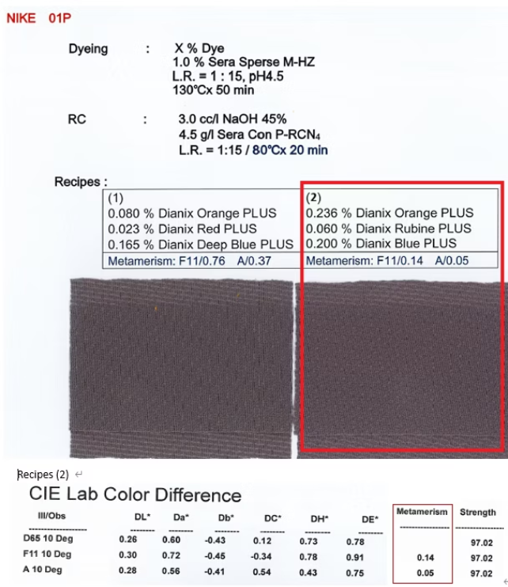

Dianix Red PLUS

0.061%

—

—

Dianix Blue PLUS

0.218%

—

0.200%

Dianix Rubine PLUS

—

—

0.060%

Goldenlon Yellow GLS BS

—

0.067%

—

Goldenlon Y/Brown WW-FS BS

—

0.080%

—

Goldenlon Red HW-3BL BS

—

0.090%

—

Goldenlon Blue F-2GS BS

—

0.190%

—

### Speaker Notes

42

## Slide 43

議題序列 #038 · #039

改善布面色跡——分散劑與清缸管理

#038 基本資訊（6298 / Boysenberry）

測試結果比較

布別

2RP90SDF30 E WA 上漿切邊

#038 結果

#039 結果

精煉後色跡仍殘留；均染剝色後色跡有稍微改善，但未完全消除。

精煉及均染剝色後，色跡均未能去除，問題更為嚴重。

申請人

台灣染色

建檔

2026/05/01

#039 基本資訊（4495 / 4EV）

兩案共同改善建議

布別

28RP75 I WA GG UVC

1

溶解染料時添加分散劑

製程特點

陶瓷磨毛 · 色布縮練

在溶解染料時，添加 0.5% 分散劑一起攪拌溶解，確保染料充分分散、避免聚集。

申請人

台灣染色

2

建檔

2026/05/01

染浴增加分散劑用量

染浴中添加 Setamol LD 分散劑 1.0%～1.5%，維持染浴穩定性，防止染料再沉澱於布面。

測試處理流程

處理方式

配方

條件

3

染色前先進行清缸處理

精煉

Sera Wash M-ELT 3.0 g/l · Na2CO3 2.0 g/l · Noveco 01 3.0 g/l

90℃ × 30min

提高清缸頻率，增加清缸次數，徹底去除缸壁殘留染料與低聚物，防止污染後續批次。

均染剝色

Sera Gal P-BMO 3.0% · Sera Wash M-ELT 3.0%

PH 4.5 · 130℃ × 30min

### Speaker Notes

43

## Slide 44

議題序列 #039 — 技術補充

ISOPON PM 清缸劑——預防布面色污的核心技術

針對染缸內壁低聚物、油垢及殘留染料所導致的布面異常色污問題，ISOPON PM 是一種結合生物可降解分散劑、還原劑與表面活性劑的液態高效清缸助劑，可從根本解決缸壁污染問題。

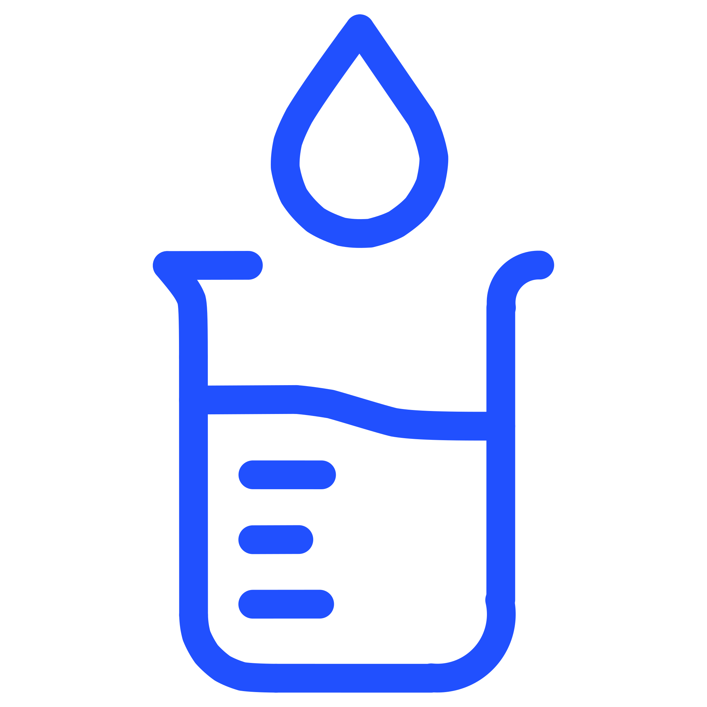

高發泡性深度清洗

溶解低聚物（Anti-oligomer）

強大發泡性使泡沫深入缸內頂部、蒸汽加熱管及管路死角，透過物理摩擦力將髒污徹底去除，清洗力遠優於傳統清缸方式。

在鹼性介質中有效溶解聚酯纖維產出的低聚物，防止其在缸壁沉積並再次轉移至布面，避免產生色點。

去除油垢與水垢

天然還原 · 環保安全

能同時清除織造殘留的油脂、蠟質，並去除傳統保險粉無法處理的加熱管水垢，有效提升升溫效率與缸體壽命。

含天然還原單元，可有效剝除殘留染料；為生質型助劑，可自然生物降解，不產生傳統保險粉洗後的有毒硫化汙泥。

### Speaker Notes

44

## Slide 45

議題序列 #039 — ISOPON PM 操作規範

ISOPON PM 清缸作業化學配方與操作流程

一般清缸法（Standard Method）

浸漬過夜清缸法（Overnight Method）

適用於污染嚴重的染缸，加強處理以徹底去除頑固污垢：

項目

規格

加強配方

ISOPON PM 8 g/l + 液鹼 8 g/l + Permulsin AO 300 5 g/l

浴量

染色水位之 1/2 至 1/4

ISOPON PM

8 g/l（或 20 kg / 500 kg 染機）

流程

升溫至 130℃ 運轉 30 min → 關泵靜置過夜 → 隔日升溫至 90℃ 循環 30 min → 排液清洗

液鹼（50%）

8 g/l（或 15 kg / 500 kg 染機）

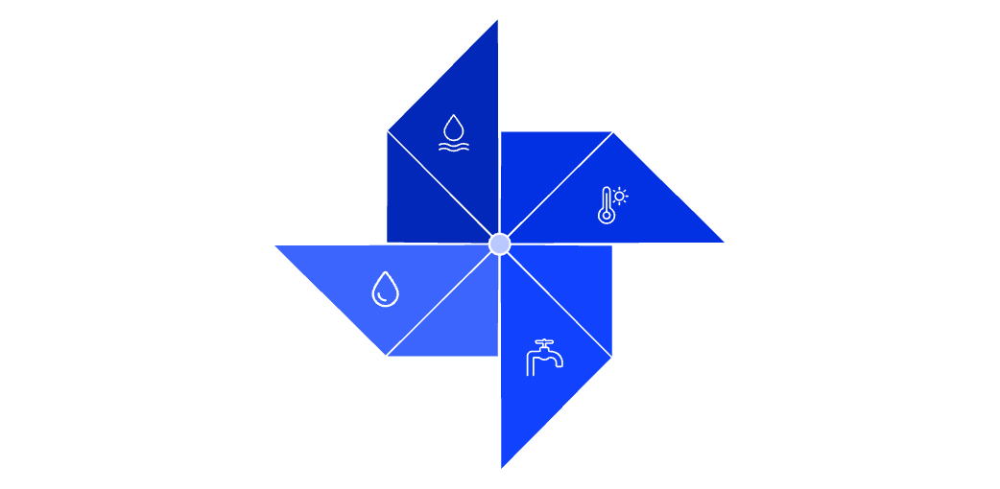

與傳統保險粉清缸之優勢比較

加熱至130°C，保持30分鐘

比較項目

傳統保險粉

ISOPON PM

加水至70°C以下並投藥

機體保護

易造成墊圈老化漏缸

不傷機體，節省保養費

冷至80°C，消泡並放水

二次污染

殘液無法再利用

殘液可循環清潔副缸

溫水沖洗，酸中和1–2 g/l，5–10 分

低聚物處理

效果有限

鹼性介質中有效溶解

第一次使用 ISOPON PM 時，建議連續清缸兩次，確保缸體徹底清潔。

環保性

產生有毒硫化汙泥

生物可自然降解

異味

刺鼻異味明顯

無刺鼻異味

建議在每次更換色系或處理高含油坯布後，定期使用 ISOPON PM 進行 130℃ 高溫清缸，有效維持缸壁潔淨。

### Speaker Notes

45

## Slide 46

議題序列 #040

改善水洗牢度——典藏藍 D65/CWF 配方優化

基本資訊

三組配方比較

申請人

台灣化驗室

染料

Riits A

Riits B

DyStar

建檔時間

2026/05/08

Br. Red HW-NN BS

0.52%

0.47%

—

RS9D0042-PE02AT（1117）

台灣 ITEM

T//Q Blue S-BG BS

1.50%

1.30%

—

布別

32CDR75RP50SP40 E GG WA

Blue DXF-R BS

2.50%

—

—

顏色

433-660 典藏藍

成分

87% Recycled Polyester · 13% Spandex

Blue DXF-RN BS

—

2.80%

—

問題描述

Dianix Yellow S-6G

—

—

0.18%

典藏藍色號之水洗牢度（WSF）目前僅達 2.5N，遠低於客戶要求的 3.5 以上，需透過重新配方組合提升牢度表現，同時維持 D65/CWF 雙光源差在可接受範圍內。

Dianix Turquoise S-BG

—

—

1.82%

Dianix Violet S-4R

—

—

0.57%

Dianix Br. Blue RN new

—

—

0.70%

光源差（CWF MI 值）

Riits A

Riits B

CWF / 0.27

CWF / 0.31

DyStar

CWF / 0.31

三組配方光源差均在可接受範圍。水洗牢度測試結果已附件提供，待遠東確認牢度是否達標後決定最終配方。

### Speaker Notes

46

## Slide 47

議題序列 #040 — 附件

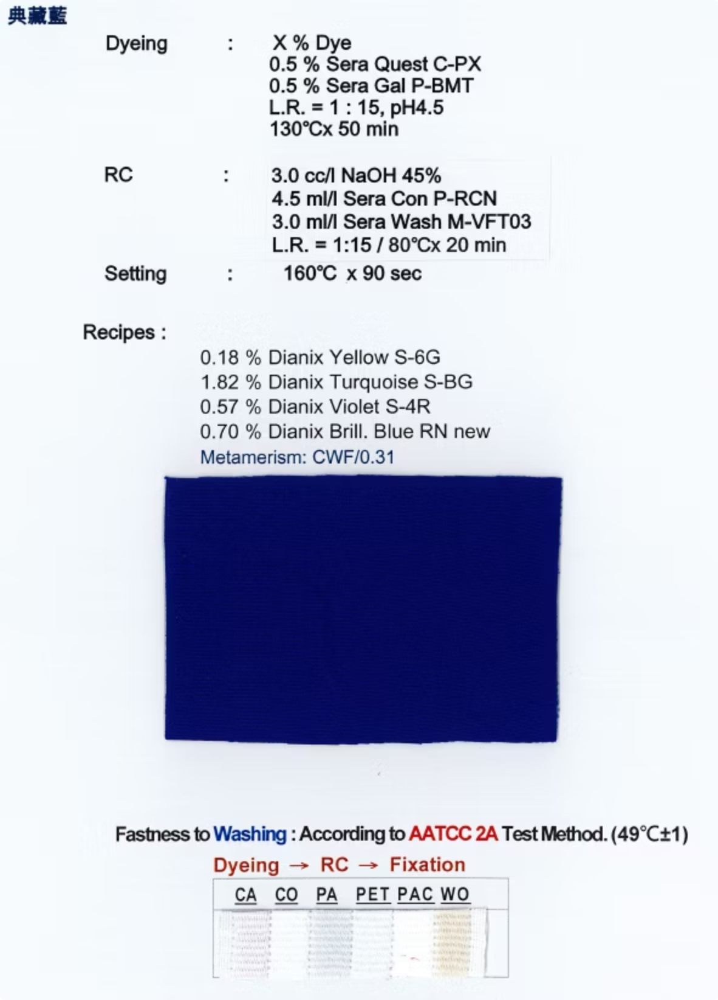

典藏藍牢度測試附件

以下附件呈現 Riits 與 DyStar 三組配方的水洗牢度與色光對比測試結果，供遠東品管人員進行最終評估。

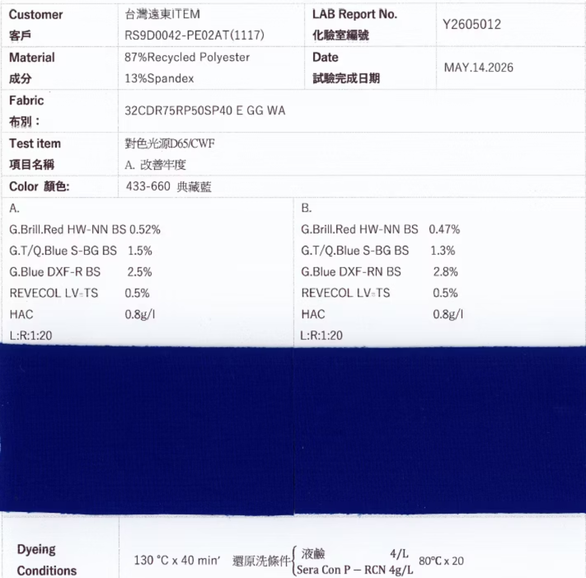

### Speaker Notes

47

## Slide 48

議題序列 #041

替代配方組合——日光黃光源差改善

基本資訊

三組配方比較

申請人

台灣化驗室

染料

原配方

Riits

DyStar

建檔時間

2026/05/08

Dianix Br. Orange G

0.380%（限量）

1.20%

—

台灣 ITEM

647843

Dianix Flavine XF new

0.10%

—

—

布別

28T75（SIGMA）J WA

顏色

76H 日光黃

成分

100% POLYESTER

Goldenlon Scarlet HW-3G BS

0.02%

0.26%

—

問題描述

客戶要求對回提供的色樣光源差須符合規格，且限制不得使用 Dianix Br. Orange G 染料（或嚴格限制用量），需尋求符合光源差要求的替代配方。

Goldenlon Yellow 4G BS

—

0.21%

—

Goldenlon Y/Brown HW-3R 01 BS

—

0.063%

—

Goldenlon Red HW-3BL BS

—

0.002%

—

Dianix Sport Red SFN

—

0.090%

—

Dianix Orange AM-SLR

—

—

0.900%

光源差（MI 值）比較

原配方

Riits 配方

- F11 / 1.68
- A / 1.28（差異大）

- F11 / 0.60
- A / 0.55（稍大）

DyStar 配方

- F11 / —
- （光源差較小）

DyStar 配方策略：將 Br. Orange G 用量控制在 0.5% 以下，搭配 Orange AM-SLR 補足色量，既符合用量限制，又有效降低光源差。Riits 配方則完全避開 Br. Orange G，但光源差稍大。

### Speaker Notes

48

## Slide 49

議題序列 #041 — 附件

日光黃配方光源差比對附件

以下兩張附件分別呈現 Riits 配方與 DyStar 配方在不同光源（F11、A 光源）下的色光比對結果，紅色框標示光源差較小的配方組合，供遠東選定最終方案。

Riits 配方光源差比對

DyStar 配方光源差比對

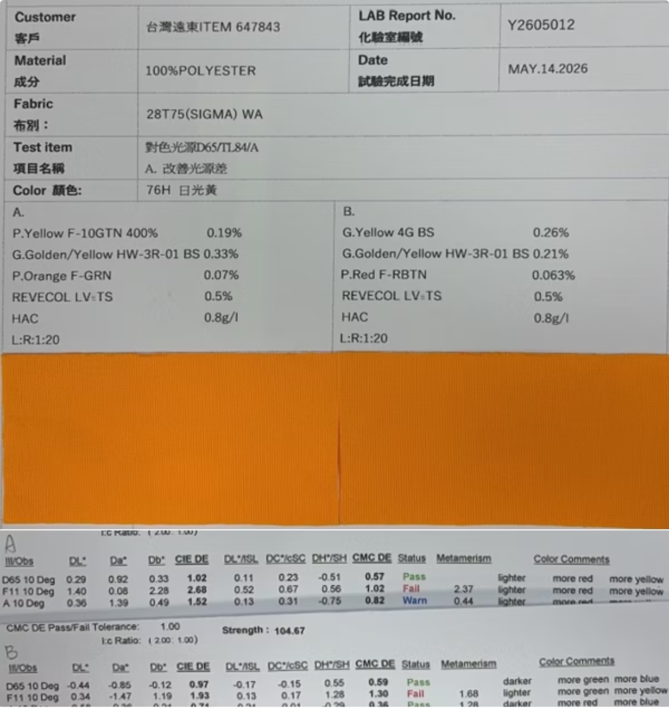

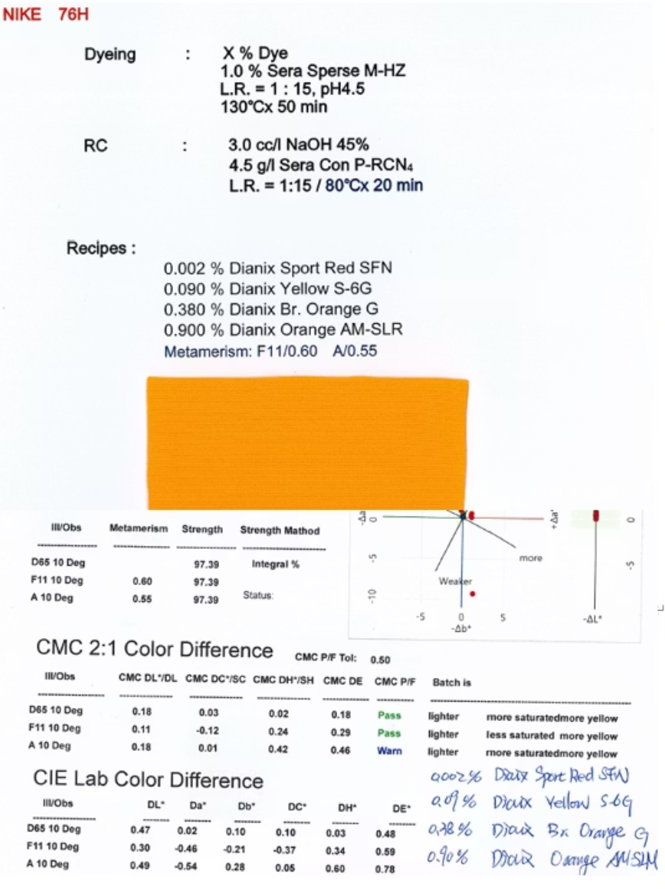

### Speaker Notes

49

## Slide 50

議題序列 #042 · #043

改善布面雞爪——製程參數優化

議題 #042（ITEM 4397）與 #043（ITEM 2060）均涉及 28RP75I WA 系列布種之布面雞爪（皺痕）問題，由台灣染色現場提出，兩案改善方向高度一致，以下進行合併分析說明。

兩案基本資訊對比

三大改善措施

1

調整浴比至 L:R ≒ 1:15～20

項目

#042（4397）

#043（2060）

提高染浴液比，使布料在缸內有充足空間自由運動，降低布料相互擠壓與摩擦，是預防雞爪最根本的措施。

28RP75I WA UVC

布別

28RP75I WA

顏色

00A

6JY

2

缸鍊精練時添加 FHB conc

建檔日期

2026/05/08

2026/05/08

在精練配方（精練劑 + 鹼）中加入 0.3 g/l FHB conc（潤滑劑），改善布料在缸內的運動順暢性，減少折痕形成機率。

製程特點

溜布外廠

缸練 · 陶瓷磨毛

雞爪成因分析

3

染色過程添加 FHB conc 並調整降溫速率

布面雞爪（折痕）通常由以下因素造成：浴比過低（布與液比例失當，布料擠壓摩擦）、缸內布料運動不順暢、高溫段降溫速率過快（布料急速收縮造成折痕固定）。

染色浴中同樣加入 0.3 g/l FHB conc，並嚴格控制降溫曲線，讓布料在高溫段緩慢收縮，避免急速降溫造成折痕固定。

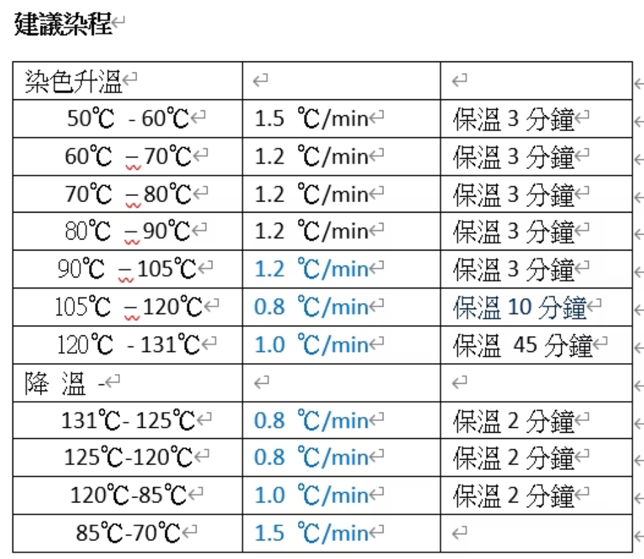

### Speaker Notes

50

## Slide 51

議題序列 #042 · #043 — 降溫曲線規範

染色降溫速率控制規範

雞爪改善的關鍵在於精確控制高溫染色後的降溫曲線。以下為兩案建議之三段式分速降溫制度，分別對應不同溫度區間的布料物性，避免急速降溫導致折痕固化。

高溫段

中溫段

- 131℃ → 120℃
- 降溫速率：0.8℃/min
- （最慢，布料結構最敏感）

- 120℃ → 85℃
- 降溫速率：1.0℃/min
- （中速，持續緩降）

低溫段（#042）

低溫段（#043）

- 85℃ → 70℃ 以下
- 降溫速率：1.5℃/min
- （可略微加速）

- 85℃ → 70℃ 以下
- 降溫速率：1.5～2.0℃/min
- （彈性調整）

以上染色製程微調整，若有需要，台灣染色現場技術人員可至現場協助一同進行研商與實地操作確認。

#042 布面現況

#043 布面現況

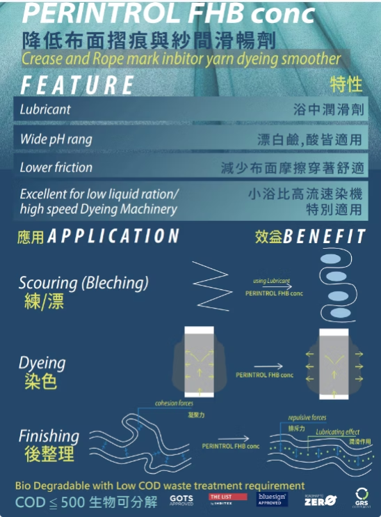

### Speaker Notes

51

## Slide 52

議題改善方案總結

本次 11 個議題涵蓋配方優化、牢度提升、布面異常排除三大類別，彙整各案關鍵結論如下，作為研發團隊後續追蹤與決策依據。

序列

項目

問題

改善方案

狀態

#023

優化配方組合

ACE+S-BG 色花

待遠東確認

以 AM-R 取代 S-BG；升溫段放慢升溫速度

#034

改善牢度鮮豔度

WSF/MIGS 不達標

原配方已最佳；新配方光源差大，牢度仍不足

持續研究

✅ 已解決

#035

ALO YOGA 酚黃

酚黃 3.5→4.0

定型前調整 pH

#036

PATAGONIA 橫條

尼龍布橫條嚴重

胚布前處理（Revecol LV-AN）效果最佳

待遠東確認

#037

改善 TL84 光源差

光源差超標

Riits/DyStar 配方均明顯改善，DyStar 最佳

待遠東確認

#038

布面色跡

色跡均染部分改善

執行中

增加分散劑用量；提高清缸頻率

#039

布面色跡（嚴重）

精煉均染均無效

Setamol LD 分散劑；ISOPON PM 清缸

執行中

#040

典藏藍牢度

WSF 2.5N→3.5+

Riits/DyStar 配方光源差均合格，牢度待確認

待遠東確認

#041

日光黃替代配方

禁用 Br. Orange G

待遠東確認

DyStar 限量使用 + Orange AM-SLR 補足

#042

布面雞爪（4397）

布面折痕

調整浴比；FHB conc；三段降溫曲線

執行中

#043

布面雞爪（2060）

布面折痕

調整浴比；FHB conc；三段降溫曲線

執行中

### Speaker Notes

52

## Slide 53

後續追蹤事項與建議行動

待遠東回覆確認事項

製程改善持續執行項目

#023 新配方階段染色結果確認

分散劑管理（#038 · #039）

定期清缸制度建立（#039）

已於 5/25 補上階段染色數據，請遠東評估新配方（AM-R 取代 S-BG）之色光與光源差是否符合出貨標準。

溶解染料時添加 0.5% 分散劑；染浴中 Setamol LD 用量提升至 1.0%～1.5%，立即執行。

導入 ISOPON PM 130℃ 高溫清缸，建議每次換色系或高油坯布後執行，形成標準 SOP。

#036 PATAGONIA 色布品質評估

已提供四組條件之色布，請遠東確認前處理方案（方案 2）橫條改善效果是否達到客戶要求。

#037 光源差配方選定

雞爪改善製程調整（#042 · #043）

#034 牢度配方持續研究

Riits 與 DyStar 兩組配方均已提供，請遠東確認選用哪組配方進行量產。

調整浴比至 L:R ≒ 1:15～20，精練及染色添加 0.3 g/l FHB conc，執行三段式降溫曲線。

原配方雖已為最佳組合，但仍未達客戶牢度要求，需持續開發符合光源差且牢度達標的新染料組合。

#040 典藏藍牢度測試結果審核

三組配方水洗牢度測試附件已提供，請遠東品管人員確認是否達到 3.5 以上目標。

#041 日光黃配方最終選定

如需現場技術支援，台灣染色現場及化驗室技術人員可提供到廠協助，歡迎聯繫安排。

DyStar 配方光源差優於 Riits，但需確認限量使用 Br. Orange G 是否符合客戶規範。

### Speaker Notes

53

## Slide 54

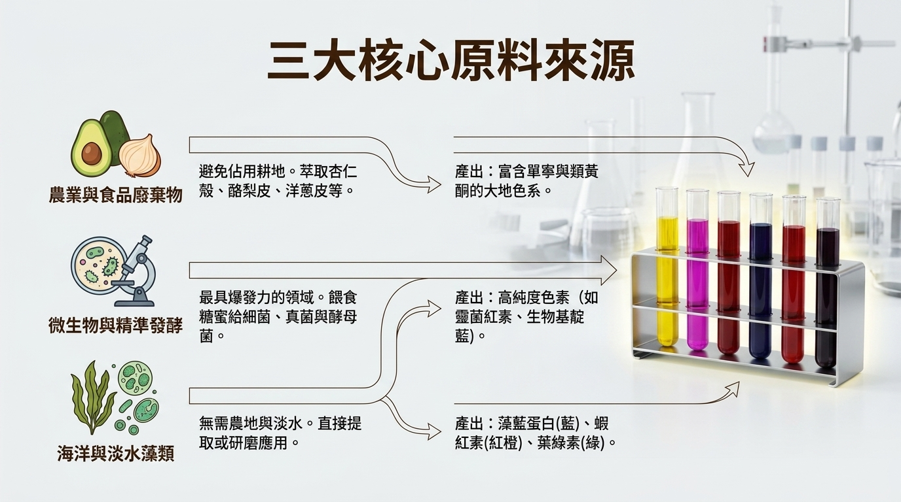

## Slide 55

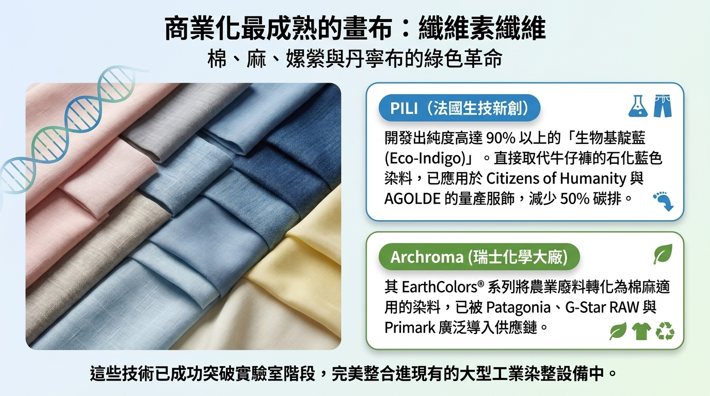

## Slide 56

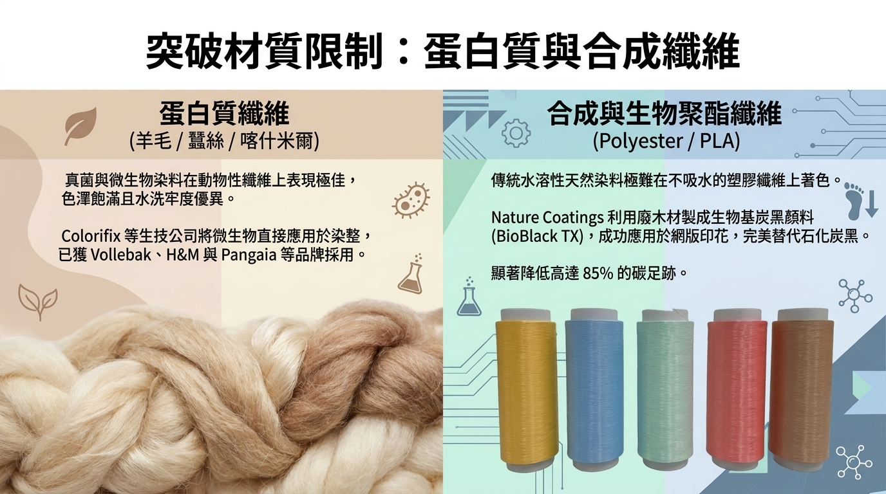

## Slide 57

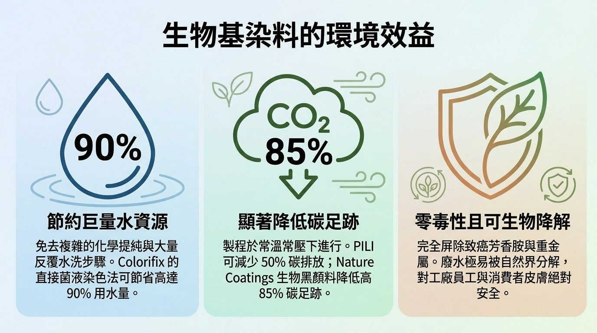

## Slide 58

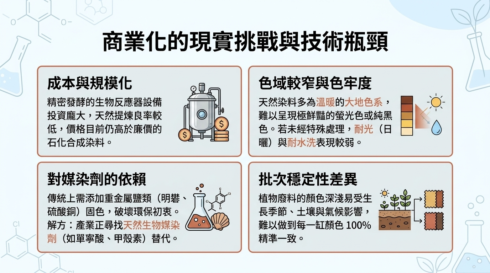

## Slide 59

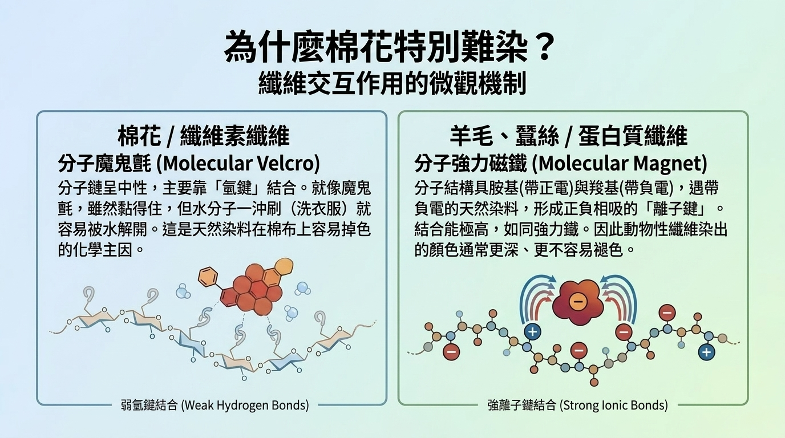

## Slide 60

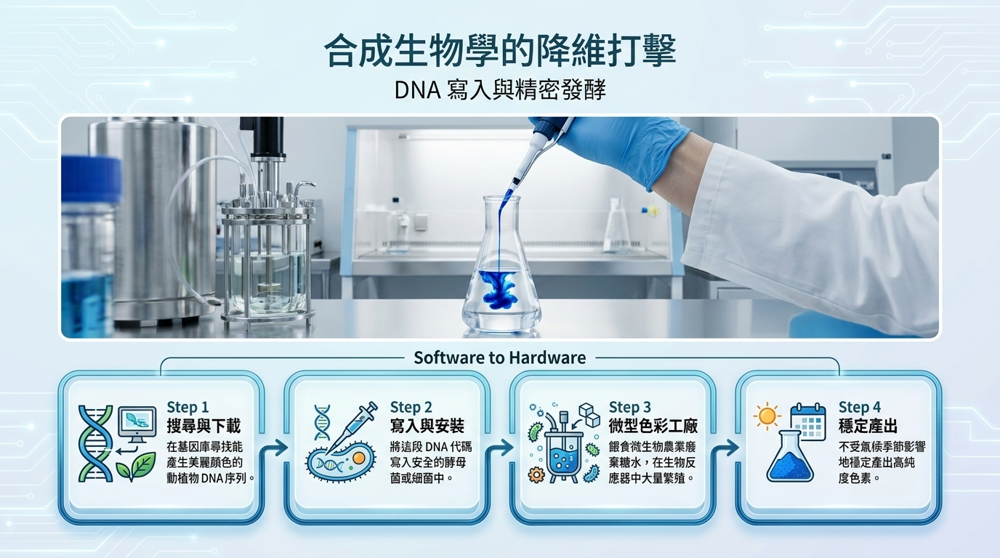

## Slide 61

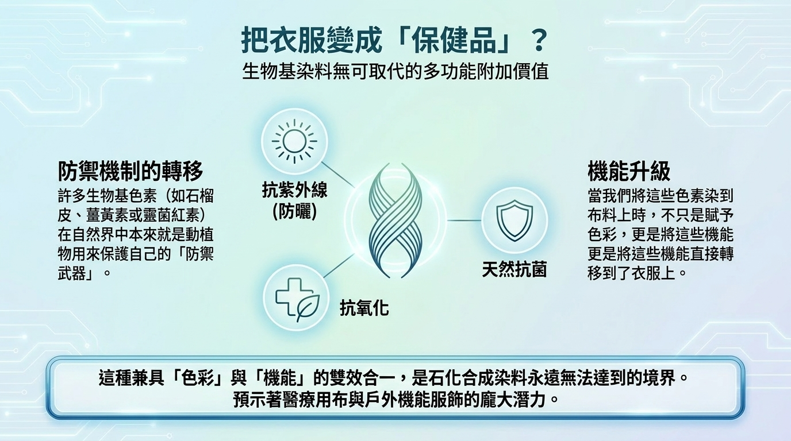

## Slide 62

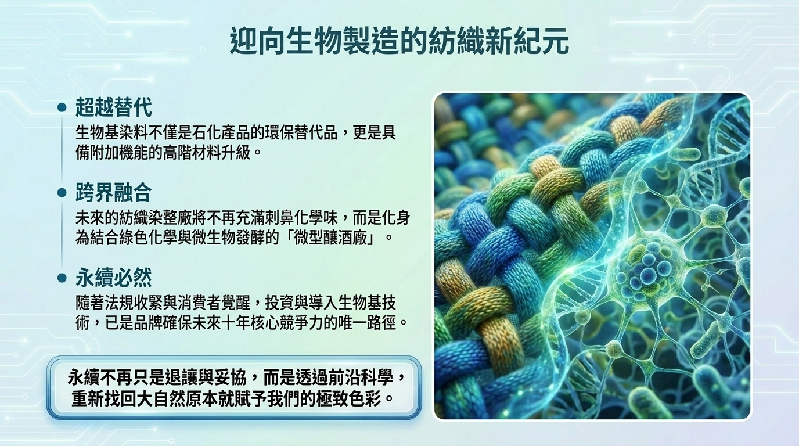
